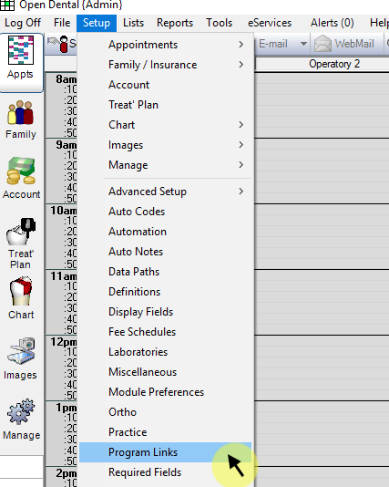
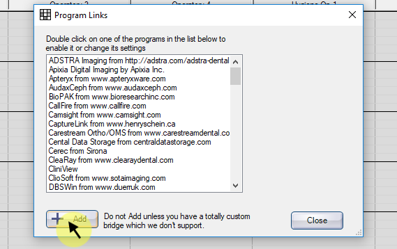
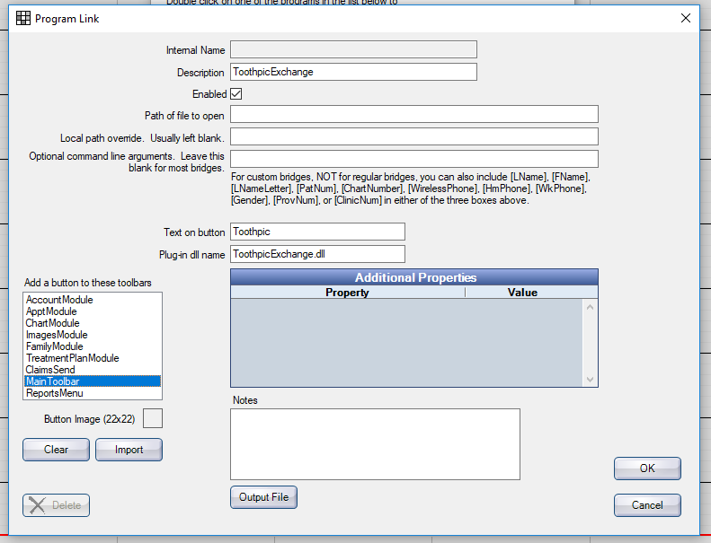
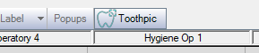

Plugin Setup
============

Source Code
-----------
The source code is included with the project. 
This can be altered, however in order to install the plugin in OpenDental, it must be compiled as a `.dll` file.
The file *must* be called `ToothpicExchange.dll`.
If no modifications are required, a pre-compiled version is included.

Setup in Open Dental
--------------------

1. If not already compiled, the sourcecode must be compiled into a file called `ToothpicExchange.dll`
2. ToothpicExchange.dll must be copied to OpenDental's folder e.g `C:\Program Files\Open Dental\`
3. In the OpenDental main menu, click `Setup` > `Program Links`.

	

4. A new window will open with a list of Program Links already established, click the `Add` button in the bottom left hand corner.

	

5. A new window will open to enter the plugin settings. Input the following:

			Description:		ToothpicExchange
			Enabled:			[Checked]
			Text on Button:		Toothpic
			Plug-in dll name:	ToothpicExchange.dll

	Ensure the option `Main Toolbar` is selected in the section `Add a button to these toolbars`.

	

6. Save the settings.

7. The Toothpic plugin will now be added to the Main Toolbar in OpenDental.
	
	

For more information, consult the OpenDental [plugin framework page](http://opendental.com/manual/plugins.html).
