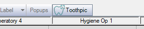

Using the Plugin
================

The plugin is relatively straightforward. It is accessed through the OpenDental toolbar which is accessible in every module.
The plugin offers functionality to import or export patient information to/from OpenDental and Toothpic.

Opening the Plugin
------------------

Once the plugin has been [installed](plugin_installation.md), simply click the Toothpic button in the main toolbar of OpenDental.

Logging in
----------

The plugin will prompt the practice to login with their Toothpic `username` and `password`.

Homepage
--------

Once the practice has been authenticated, ToothpicExchange will launch. This is where the practice can either import or export patient information.

Importing Info
----------------------

In order to import patient information, simply click the `Import Patient Info` button to begin.
A new window will open with a list of users available to import. These users are loaded from Toothpic, and thus only users who the practice are authorised to view will appear on the list.
There is a search box at the top of the form to filter users by first name, last name or by email address.

Select the user to import, and press `Add User to OpenDental`. If a user with the same name and date of birth already exists in OpenDental, the software will warn about a patient conflict.
The practice may review this information and choose to proceed if they are not duplicates.

The patient edit form in OpenDental will now launch, and the practice may insert additional information about the patient.
To save the information, click `OK`, otherwise `Cancel`.

Exporting Info
--------------

Return to the homepage of the ToothpicExchange plugin. A user must be **selected** in OpenDental before proceeding with an export.
To select a patient, the practice must click the `Select Patient` button in the top left hand corner.

Once a patient has been selected, the option to `Export Patient Info` will now become available. Click it to export.

This will send the patient to Toothpic's API and will advise the practice whether this was successful or not.